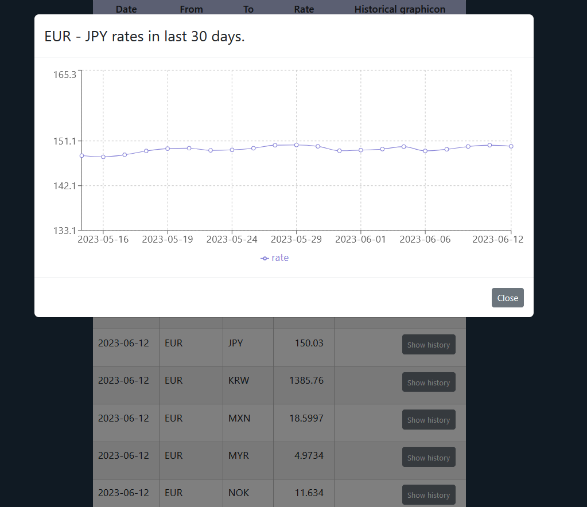

# new_exchange_rate

A kind of demo app using @tanstack libraries: react-query and react-table.

### under development

ATM you can get actual exchange rates based on EUR and a retrospective graph per relation for the last 30 days.
ToDo: error-handling, tests...

